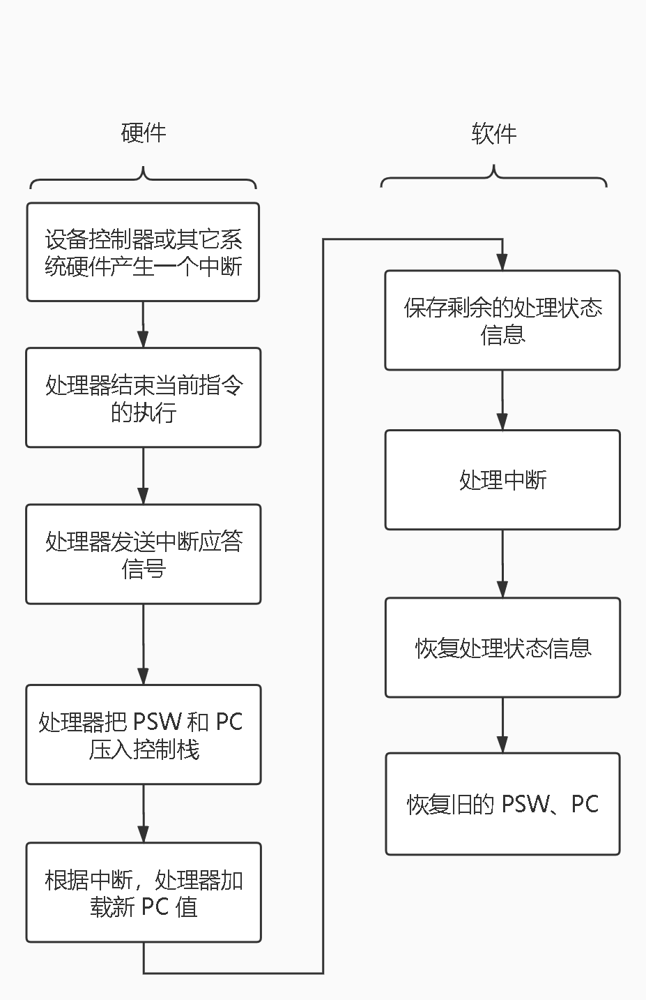

# 1 计算机系统

## 1.1 构成

- **处理器**

  PC 程序计数器

  IR 指令寄存器

  MAR 内存地址寄存器

  MBR 内存缓存寄存器

  I/O AR 输入输出地址寄存器

  I/O BR 输入输出缓存寄存器

- **内存**

- **输入/输出模块**

- **系统总线**

## 1.2 指令

**指令格式：操作码+地址**

CPU 从指令寄存器中取一条指令，并且执行它。

指令有四种：

- 处理器-存储器
- 处理器-IO
- 数据处理：处理器做**算术操作、逻辑操作**。
- 控制：跳转。

| 操作码 |      对应操作      |
| :----: | :----------------: |
|  0001  |    从内存载入AC    |
|  0010  |   将 AC 载入内存   |
|  0101  | 从内存一个数加到AC |

假设内存映射如下：

300:1940

301:5941

302:2941

~

940:0003

941:0002

CPU 寄存器映射如下：

PC:300

AC:

IR:

2+3 = 5 操作过程

1. PC 指向内存300处，把内存 300处的指令载入到 IR，并且PC自增， 指向301。CPU 解析指令，1940 即把内存940的位置的内容载入到AC （把0003加载到 AC）。
2.  PC 此时在301,加载指令 5941 到IR，并且 PC 自增 1。CPU解析指令，5941 即把内存中941位置的内容和 AC 做加法，结果留在 AC 。
3. PC 此时在302，加载指令2941 到 IR ，并且 PC 自增 1。CPU 解析指令，2941 即把 AC 的内容存储到内存941的位置。
4. 2+3 结果5，存储在 941 的位置。 

## 1.3 中断

|     中断     |                             描述                             |
| :----------: | :----------------------------------------------------------: |
|   程序中断   | 由**指令执行结果**产生，算术溢出、被零除、试图执行一条非法机器指令或访问用户不允许的存储位置。 |
|   时钟中断   |   **处理器内部计时器**产生，允许操作系统按一定规律执行函数   |
|   I/O 中断   | 由 **I/O 控制器**产生，用于发信号通知一个操作正常完成或者错误条件 |
| 硬件失效中断 |             由**掉电、存储器奇偶校验出错**等产生             |

**中断服务例程 ISR（Interrupt Service Routine）**：触发中断后，执行的部分。（中断函数）

处理多个中断的方法

- 处理一个中断时，禁止再发生中断。
- 定义中断优先级。

## 1.4 高速缓存

CPU-高速缓存：字传送

高速缓存-内存：块传送

## 1.5 直接内存存取

执行 I/O 操作的技术：**可编程 I/O、中断驱动I/O 、直接内存存取（DMA Direct  Memory Access）**

**可编程I/O**：处理器通常必须等待很长时间，以确定I/O模块是否做好了接收或发送更多数据的准备，处理器在等待时不断询问 I/O 状态，严重降低整个系统性能。

**中断驱动I/O**：处理器发送数据传输命令，处理器继续做其他工作。当 I/O 模块准备好与处理器交换数据时，模块打断处理器的执行并且请求服务。处理器进行数据传输，完成后恢复之前的处理器的执行。缺陷在于，传输速度受限于处理器测试和提供服务的速度、处理器忙于管理 I/O 传输（必须执行很多指令）。

**DMA**：处理器发送数据传输命令，传输过程处理器不干预，传输结束时 DMA 模块向处理器发送中断信号。（当处理器需要使用系统总线而DMA正在使用系统总线时，处理器会等待一个总线周期（在总线上传输一个字的时间））

